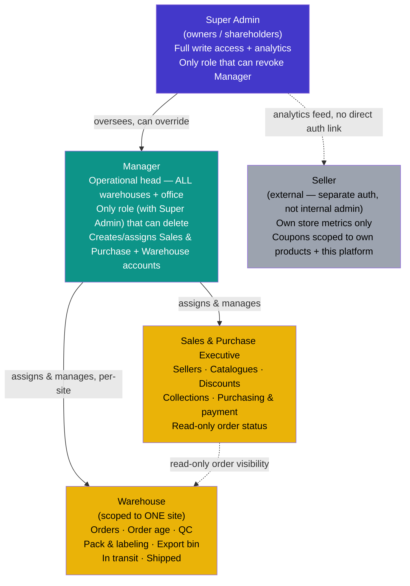

# WishDrop — Roles, Permissions & Policy Map (v2 — corrected to match built route tree)

*Defines every platform role, what each can see/do, and the governing policies. Covers internal admin roles + the external Seller Dashboard. Public storefront and signed-in customer account pages are out of scope here — this is the admin/ops side only.*

**What changed in this revision:** Section 7 (Page Routes) has been rewritten to match the actual folder structure that was built, which diverged from the original plan in three ways:
1. **`chat`, `requests`, and `orders` moved out of `(manager)` into a new `(common)` route group** — they're shared by Manager and Sales & Purchase, and living inside `(manager)` would have meant Sales & Purchase couldn't reach them without either a broken auth guard or duplicated pages.
2. **Dashboards went from one shared `/admin/dashboard` to three separate role-specific routes** (`manager-dashboard`, `sales-dashboard`, `warehouse-dashboard`) instead of one URL that branches on role. This is a legitimate alternative approach, but it means login redirect logic must map role → correct dashboard URL explicitly.
3. **`/admin/scrape-health` was added** under `(sales)` — not in the original plan, but it's the operational home for the per-domain failed-scrape logging described in the requirements doc, so it belongs there.

Everything else (role hierarchy, permission matrix, governing policies, schema) is unchanged from the original and reproduced below for a single source of truth.

**Defaults applied where a decision was still open (flagged inline — confirm or override):**
- Super Admin = full write access across the platform, in addition to analytics/oversight and role & platform management — effectively a superset of every other role.
- Manager = full operational control across all warehouses **and** creates/assigns Sales & Purchase / Warehouse staff accounts.

---

## 1. Role hierarchy

```
Super Admin        — owners/shareholders. Oversight & analytics. Not in daily ops.
   │
Manager            — operational head. Spans ALL warehouses + office. Runs the business day to day.
   │
   ├── Sales & Purchase Executive   — sourcing, catalogue, pricing, purchasing
   └── Warehouse                    — fulfillment pipeline, scoped to ONE warehouse site

(separate, external)
Seller              — third-party affiliated stores. Own auth scope. Never shares admin session.
```

**Key structural rule:** Sales & Purchase Executive and Warehouse are **siblings**, not a hierarchy between themselves — neither can act on the other's domain. Manager is the only role with reach across both, and across every warehouse location. Warehouse-role accounts are scoped to **one site**; Manager is the only operational role with cross-site reach.



*Dotted lines indicate read-only or non-hierarchical relationships (Sales & Purchase's view into order status; Seller data feeding Super Admin analytics without any shared authentication path).*

---

## 2. Full permission matrix

Legend: ✅ full write access · 👁 view/read-only · ❌ no access

| Feature / Action | Super Admin | Manager | Sales & Purchase Exec | Warehouse (own site) |
|---|---|---|---|---|
| **Sourcing & Catalogue** | | | | |
| Add/edit sellers — manual entry | ✅ | ✅ | ✅ | ❌ |
| Add/edit sellers — scraping/extractor config | ✅ | ✅ | ✅ | ❌ |
| Add/edit catalogues | ✅ | ✅ | ✅ | ❌ |
| Discount management | ✅ | ✅ | ✅ | ❌ |
| Collection filtering (auto rules) | ✅ | ✅ | ✅ | ❌ |
| Collection manual curation (hand-picked adds) | ✅ | ✅ | ✅ | ❌ |
| Purchase execution (placing the buy) | ✅ | ✅ | ✅ | ❌ |
| Payment handling for purchases | ✅ | ✅ | ✅ | ❌ |
| Scrape/extractor health monitoring | ✅ | ✅ | ✅ | ❌ |
| **Fulfillment Pipeline** | | | | |
| View orders | ✅ (all sites) | ✅ (all sites) | 👁 | ✅ (own site) |
| Order age / SLA tracking | ✅ (all sites) | ✅ (all sites) | 👁 | ✅ (own site) |
| Quality Check (QC) | ✅ (all sites) | ✅ (all sites) | ❌ | ✅ (own site) |
| Pack & labeling | ✅ (all sites) | ✅ (all sites) | ❌ | ✅ (own site) |
| Export bin management | ✅ (all sites) | ✅ (all sites) | ❌ | ✅ (own site) |
| In-transit status updates | ✅ (all sites) | ✅ (all sites) | ❌ | ✅ (own site) |
| Shipped / delivered status updates | ✅ (all sites) | ✅ (all sites) | ❌ | ✅ (own site) |
| **Destructive Actions** | | | | |
| Delete order | ✅ | ✅ | ❌ | ❌ |
| Delete catalogue/listing | ✅ | ✅ | ❌ | ❌ |
| Delete seller record | ✅ | ✅ | ❌ | ❌ |
| Delete discount/coupon | ✅ | ✅ | ❌ | ❌ |
| **Chat / Support (from prior WhatsApp-sync work)** | | | | |
| View customer chat threads | ✅ | ✅ | ✅ (own leads/orders) | ❌ |
| Reply in customer chat thread | ✅ | ✅ | ✅ | ❌ |
| Manual "Send via WhatsApp" deep-link action | ✅ | ✅ | ✅ | ❌ |
| **Staffing & Platform** | | | | |
| Create/assign Sales & Purchase accounts | ✅ | ✅ | ❌ | ❌ |
| Create/assign Warehouse accounts (per site) | ✅ | ✅ | ❌ | ❌ |
| Assign/revoke Manager role | ✅ only | ❌ | ❌ | ❌ |
| Platform-wide settings (payment gateway, pricing engine config, etc.) | ✅ only | ❌ | ❌ | ❌ |
| Cross-warehouse & cross-channel analytics | ✅ | ✅ | ❌ | ❌ |
| Per-site operational reporting | ✅ | ✅ | ❌ | 👁 (own site) |

**Correction from v1:** the "automated WhatsApp sync (n8n)" row has been replaced with **"manual Send via WhatsApp deep-link action."** Per the finalized WhatsApp cost research (Section 5 of the requirements doc), WishDrop is **not** building Cloud API / n8n automation in the near term — outbound WhatsApp messages are a manual `wa.me` deep-link a human clicks send on, kept at $0 cost. Any reference elsewhere in older docs to "automated n8n sync" describes an earlier plan that was superseded by the cost research; this doc now reflects the current, actually-being-built architecture.

---

## 3. Seller Dashboard (external, separate scope)

**Not an admin role.** Sellers are third-party affiliated stores (Channel 1) — they must never share the internal admin auth/session system, and must never see anything outside their own store's data.

| Feature | Access |
|---|---|
| Store-wise order metrics (received / dispatched / pending) | ✅ own store only |
| Coupon creation for own products | ✅ own store only |
| Coupon scope enforcement | Must be locked to: this seller + this platform + this seller's products. A seller cannot create a platform-wide or cross-seller discount. |
| View other sellers' data | ❌ — structurally impossible, not just permission-gated |
| View internal admin tools (orders pipeline, chat, staffing) | ❌ |
| Delete own catalogue entries | ❌ — deactivate/hide only (prevents orphaning open orders); actual delete stays Manager-only, same as internal delete policy |

**Still out of scope for the current build pass:** the Seller Dashboard needs its own separate route tree (`/seller/*`) and its own auth system — nothing in the `/admin` tree below should be reachable by a seller session. See §7.6.

---

## 4. Governing policies

### 4.1 Delete policy
- **Super Admin and Manager can both delete anything**, across every deletable entity (orders, listings, sellers, discounts). Super Admin's delete access sits above Manager's, not alongside it as a separate carve-out — it's part of Super Admin's full-write-access default.
- Sellers never get hard-delete on their own listings — deactivate/hide only, to avoid orphaning in-flight orders tied to that listing.
- Every delete action should be soft-deleted (flagged, not removed) at the database level regardless of role, so disputes/audits aren't blocked by an irreversible action — this mirrors the same "never hard-delete" principle already applied to the 30-day chat display window.
- Because two roles now hold delete rights, the `audit_log` (§5) matters more, not less — every delete needs an immutable record of *which* role/account performed it.
- **Open question surfaced during route-spec review:** confirm whether any front-end screen ever actually exposes a true hard-delete button for Manager/Super Admin, or whether "delete" in this matrix only ever manifests as deactivate/soft-delete in the UI, with true removal reserved for database-level/support-ticket use. Recommend the latter — no UI surface needs a literal "permanently delete" control given the soft-delete-everywhere principle above.

### 4.2 Scoping policy
- **Warehouse role = single-site scope.** A Warehouse account only sees/acts on orders routed to their own warehouse. This is what structurally distinguishes Warehouse from Manager — same feature set, different reach.
- **Manager = all-site scope.** The only operational role with cross-warehouse reach, by design — this is what makes Manager "the person responsible in the field across all warehouses and the office."
- **Sales & Purchase Executive = functional scope, not site scope** — their domain is sourcing/catalogue/pricing, which isn't warehouse-bound, so no site restriction applies to them.
- **Sellers = own-store scope, enforced structurally** (separate table/auth, not a shared `users` table with a role flag) so a query bug can't leak cross-seller data.
- **Data-layer enforcement is non-negotiable:** `warehouse_id` on `admin_users` must be what every Warehouse-scoped query filters by, server-side, never trusting a client-supplied site parameter. This applies to every Warehouse route in §7.3 below (qc, pack-label, export-bin, in-transit, shipped) and to the Warehouse-filtered view of the shared `/admin/orders` page.

### 4.3 Visibility (read-only) policy
- Super Admin now has full write access in addition to analytics/reporting — no longer positioned as view-only. Worth deciding in practice whether owners *actually use* this write access day to day, or hold it as a capability without exercising it — the permission existing doesn't mean it needs to be part of a Super Admin's routine workflow.
- Sales & Purchase gets **read-only visibility into order status** (not QC/warehouse actions) so they can answer a customer chat question ("your item is in QC") without being able to change warehouse state. **Open item:** does this read-only visibility extend to pipeline-stage *detail* (e.g. QC pass/fail notes) or only the coarse stage label ("in QC")? Currently modeled as status-only; worth resolving since it caps how much Sales & Purchase can tell a customer in chat without pinging Warehouse.
- Warehouse gets **no visibility into sourcing/catalogue/pricing** — no functional need, keeps the pipeline's two halves cleanly separated.

### 4.4 Staffing policy
- Manager creates and assigns both Sales & Purchase and Warehouse accounts — including which warehouse site a Warehouse account is scoped to.
- Only Super Admin can assign or revoke the Manager role itself — this is the one staffing action kept at the ownership level, since it's the role with the broadest operational blast radius.
- Deactivating a staff account that has active work in progress (a Warehouse account with orders currently assigned, a Sales & Purchase account with open requests) should be blocked or require reassignment first — otherwise work is silently orphaned.

### 4.5 Chat / WhatsApp policy (corrected — see note under §2)
- Only Manager and Sales & Purchase can reply in customer chat threads — Warehouse has no customer-facing role.
- **Outbound WhatsApp is a manual, one-way, $0-cost deep-link action** — when ops replies in-platform, a "Send via WhatsApp" button opens a prefilled `wa.me` link; a human clicks send inside WhatsApp itself. This is not a backend-automated push, and there is no separate "WhatsApp send" permission beyond "can reply in chat" — the action is gated by chat-reply access, not a distinct capability.
- **WhatsApp → platform is not synced.** If a customer replies on WhatsApp directly, that reply does not appear in-platform. The prefilled deep-link message copy must explicitly tell the customer to reply in-app, so a WhatsApp-only reply doesn't silently go unseen by ops.
- **Open item — chat threading model:** confirm whether a thread is scoped **one per `request_id`** (as the original requirements doc specifies) or **one per customer** (as this doc's route table implies). These are in tension and need one answer before the chat schema is built. Recommendation: one thread per customer, with individual messages taggable to a specific `requestId` for context — this avoids a customer with multiple open requests having to hunt across separate inboxes to ask one question, while still preserving per-request traceability.

---

## 5. Suggested schema shape

```
roles              (id, name)                         -- super_admin, manager, sales_purchase, warehouse
permissions        (id, key)                            -- e.g. 'order:delete', 'catalogue:write', 'qc:write'
role_permissions   (role_id, permission_id)
warehouses         (id, name, location)
admin_users        (id, name, email, role_id, warehouse_id?)   -- warehouse_id only set for Warehouse role
sellers            (id, name, store_name, ...)          -- fully separate table
seller_sessions    (seller_id, ...)                       -- separate auth, never joins admin_users
audit_log          (id, actor_id, actor_role, action, entity, entity_id, created_at)  -- every delete + role change
requests           (id, customer_id, link, note, screenshot_url, status, quoted_price, domain, created_at)
chat_threads       (id, customer_id, created_at)          -- one per customer, per §4.5 decision
chat_messages      (id, thread_id, sender_id, sender_role, body, attachment_url, request_id?, created_at)
scrape_health_log  (id, domain, status, attempted_at, error_reason?)  -- feeds /admin/scrape-health
```

`warehouse_id` on `admin_users` is what enforces the single-site scope for Warehouse accounts at the data layer, not just the UI layer — a Warehouse-role query should always filter by the account's own `warehouse_id`, never trust a client-supplied site parameter.

An `audit_log` table is recommended given how much of this policy set revolves around delete rights and role assignment — both are exactly the actions worth having an immutable record of, independent of the soft-delete pattern in §4.1.

`chat_messages.request_id` is nullable and optional — not every message in a customer's thread relates to a specific request (some are general questions), but any message that does should be tagged so ops can find request-specific context in a longer-running thread.

`scrape_health_log` is what `/admin/(sales)/scrape-health` reads from — it must be written to both by `app/api/scrape/route.ts` on every attempt (success or failure) and by the Channel 3 fallback-form submission path, or the page has no data to show.

---

## 6. Page routes — corrected to match the built tree

Two separate route trees: **`/admin`** is the shared operational surface for Manager, Sales & Purchase Executive, and Warehouse; **`/super-admin`** is the owner-only oversight surface (not part of this build pass — see §7.6). Both sit alongside the existing public site and signed-in customer `/account` routes.

`/admin` uses **four** Next.js route groups — `(common)`, `(manager)`, `(sales)`, `(warehouse)` — plus two ungrouped top-level routes (`login`, `settings`). This is a correction from the original three-group plan: **`chat`, `requests`, and `orders`** are used by both Manager and Sales & Purchase, so they live in their own `(common)` group rather than incorrectly nested inside `(manager)`, which would have made them unreachable (or required duplication) for Sales & Purchase.

**Dashboards are per-role routes, not one shared URL.** `manager-dashboard`, `sales-dashboard`, and `warehouse-dashboard` each live inside their own role group. This means the login flow's post-auth redirect must map each role to its specific dashboard URL — there is no single `/admin/dashboard` that branches on role.

```
admin/
├── (common)                     ← Manager + Sales & Purchase (orders also reaches Warehouse, filtered)
│   ├── chat/
│   │   └── [customerId]/
│   ├── orders/
│   │   ├── [orderId]/
│   │   └── age/
│   └── requests/
│       └── [requestId]/
├── (manager)                    ← Manager only
│   ├── manager-dashboard/
│   ├── reports/
│   │   └── [siteId]/
│   └── staff/
│       ├── new/
│       ├── warehouses/
│       └── [staffId]/
├── (sales)                      ← Sales & Purchase only
│   ├── catalogues/
│   │   ├── new/
│   │   └── [catalogueId]/
│   ├── collections/
│   │   └── [collectionId]/
│   │       └── curate/
│   ├── discounts/
│   │   ├── new/
│   │   └── [discountId]/
│   ├── purchases/
│   │   └── [purchaseId]/
│   │       └── payment/
│   ├── sales-dashboard/
│   ├── scrape-health/
│   └── sellers/
│       ├── new/
│       └── [sellerId]/
│           └── scrape-config/
├── (warehouse)                  ← Warehouse only, own site
│   ├── export-bin/
│   ├── in-transit/
│   ├── pack-label/
│   │   └── [orderId]/
│   ├── qc/
│   │   └── [id]/
│   ├── shipped/
│   └── warehouse-dashboard/
├── login/
└── settings/
    ├── notifications/
    └── profile/
```

---

### 6.1 `(common)` — Manager + Sales & Purchase (orders also reaches Warehouse, filtered to own site)

| Route | Who reaches it | What it covers |
|---|---|---|
| `/admin/orders` | Manager (write, all sites) · Warehouse (write, own site only) · Sales & Purchase (view only) | The single lifecycle view of every order across all three acquisition channels — order ID, customer, channel origin, current pipeline stage (`Ordered → Quality check → Shipped → Delivered`), warehouse site, age, total. Channel 3 orders (manually quoted, not run through `lib/pricing.ts`) must be visually flagged so anyone reading the list knows the price wasn't system-generated. Filter by channel, stage, site, date, and a "delayed" flag. Manager can update status and reassign warehouse; Warehouse can update status only within their own site; Sales & Purchase sees no mutation controls at all — enforced server-side, not just hidden in the UI. |
| `/admin/orders/[orderId]` | Same as above, scoped to one order | Full item list with channel-specific context (catalog SKU / scraped snapshot / original request link+screenshot), customer contact, shipping address, payment status, and a full timestamped stage-history audit trail — not just the current stage. Links out to the customer's chat thread if one exists. Manager/Warehouse can advance/roll back stage and add an **internal note** (ops-only, must never leak into the customer-facing chat thread — this boundary is critical). Manager only can reassign warehouse. |
| `/admin/orders/age` | Manager (bulk-flag) · Warehouse (own site, view + act) · Sales & Purchase (view only) | Filtered view of `/admin/orders`, default-sorted oldest-time-in-stage first, with a visual threshold marker per stage (thresholds should differ — "3 days in QC" ≠ "3 days in transit"). This is the operational mechanism behind the "reliable, no silently stuck orders" trust promise. Track both *total order age* (customer-facing SLA) and *current-stage age* (ops bottleneck detection) as separate numbers. |
| `/admin/requests` | Manager · Sales & Purchase | Queue of incoming Channel 3 (unscrapeable-link) requests. Shows request ID, customer, link, submission time, status (`sent_for_review` / `pending_quote` / `quoted` / `confirmed` / `rejected`), and time-since-submission feeding the internal SLA. Sales & Purchase opens a request to begin pricing; Manager can additionally reassign or close a request. Every submission — including failed-scrape fallbacks — must log its source domain, feeding `/admin/scrape-health`. |
| `/admin/requests/[requestId]` | Manager · Sales & Purchase | The original link, customer note, and screenshot — deliberately **no price field pre-filled**, since there's no structured data to price against yet. Set a manual quote here (this is a distinct, hand-entered number — it does **not** run through `lib/pricing.ts`/`lib/quote.ts`, which are for structured catalog/scraped data only). Mark `quoted` → `confirmed`/`rejected`. A confirmed request becomes its own order with its own confirm/pay step — it must not silently merge into the structured-data cart, since it never went through the shared pricing math. Jump directly into the linked chat thread. |
| `/admin/chat` | Manager · Sales & Purchase (Warehouse excluded — no customer-facing role) | Inbox of customer chat threads — **one thread per customer** (see §4.5 open item and recommendation), with individual messages taggable to a `requestId`. Shows unread counts, last message preview, last activity, and which request(s)/order(s) the thread relates to. Should surface which threads have gone quiet past the internal SLA. |
| `/admin/chat/[customerId]` | Manager · Sales & Purchase | Full thread within the 30-day rolling display window (older messages retained in DB, shown via a "load older history" affordance, never hard-hidden). Send a reply with optional image/video attachment, tag a reply to a specific `requestId`. **"Send via WhatsApp" is a manual deep-link action** — prefills a `wa.me` message from the reply text; a human clicks send inside WhatsApp. The prefilled copy must tell the customer to reply in-app, since WhatsApp-side replies aren't synced back. |

---

### 6.2 `(manager)` — Manager only

| Route | What it covers |
|---|---|
| `manager-dashboard` | Manager's landing page — all-site operational rollup by design (this is Manager's defining trait vs. Warehouse's single-site scope). Shows per-site breakdown (not one aggregate number) of orders by stage, QC pass/fail rate, shipping SLA hits/misses, open Channel 3 requests, unread chat threads, staff headcount per site. Summary/launchpad only — no direct editing; clicking a number routes into the full page. |
| `/admin/reports` | Historical/analytical operational reporting across every warehouse site — order age trends, QC pass rate over time, shipping SLA hit/miss rate, filterable by date range and site. Distinct from Super Admin's `/super-admin/analytics/ops`: Manager's version is operational (act on today's bottleneck), Super Admin's is oversight (understand the business over time) — don't build them as one gated component. Depends on the stage-history log existing on `/admin/orders/[orderId]` to have real data. |
| `/admin/reports/[siteId]` | Same metric set as the parent page, scoped to one site, plus site-specific context (staff headcount, assigned Warehouse accounts). |
| `/admin/staff` | Roster of all Sales & Purchase and Warehouse accounts across every site — name, role, site assignment (Warehouse only), status, last login. Create (routes to `staff/new`) or edit (routes to `staff/[staffId]`). Deactivating a Warehouse account with active orders should be blocked or require reassignment first, to avoid orphaning work. |
| `/admin/staff/new` | Create a Sales & Purchase or Warehouse account. Role selector must **never** offer Manager or Super Admin as options — Manager account creation only happens at `/super-admin/staff/new`. Site-assignment field should be shown **only** when Warehouse is selected and hidden (not just left blank) for Sales & Purchase, since Sales & Purchase is functionally scoped, not site-scoped. |
| `/admin/staff/warehouses` | Reference list of registered warehouse sites (name, location, headcount/active-order-count for context) used when assigning a Warehouse account to one. Likely also where site CRUD itself lives — deactivating a site with active orders routed to it should be blocked or require reassignment, same pattern as staff deactivation. |
| `/admin/staff/[staffId]` | Edit one staff account — details, role, site assignment (if Warehouse), status, activity history. Reassign a Warehouse account to a different site. Deactivate (soft) — per §4.1, there is likely no separate hard-delete UI action anywhere, even here. |

---

### 6.3 `(sales)` — Sales & Purchase Executive only

| Route | What it covers |
|---|---|
| `sales-dashboard` | Landing page focused on "what needs attention today," not a full operational rollup — pending purchases awaiting execution, open Channel 3 requests awaiting a quote, incomplete catalogue entries, discounts nearing expiry, unread relevant chat threads. Must contain **zero** QC/pack/shipping data, even in summary form — Sales & Purchase has explicitly no functional need to see pipeline internals (§4.3). |
| `/admin/sellers` | List of all affiliated sellers, feed-integrated and manual-mode, tagged by type. Clicking a row must branch by type: feed-integrated opens a **read-only synced product list**; manual-mode opens their **Catalogue** (full CRUD). This branching is the core §6 design decision from the requirements doc — don't build one generic seller-detail page that treats both types the same. |
| `/admin/sellers/new` | Add a seller manually. Both Sales & Purchase and Manager have unrestricted ✅ here — open item (§8) is whether this should require Manager approval instead of unilateral Sales & Purchase authority; currently built as both acting independently. Form should branch early on type: manual-mode asks for store/branding fields, feed-integrated transitions toward the feed-connection flow (API keys, OAuth) — getting the type tag right here is what makes the branching on `/admin/sellers` work later. |
| `/admin/sellers/[sellerId]` | Edit profile — feed-integrated shows read-only synced products + feed health/last-sync; manual-mode shows their full Catalogue (data source should not hardcode the still-open 1:1-vs-decoupled Catalogue assumption — see §8). Deactivating a seller must not orphan open orders tied to their listings. Feed downtime here should be impossible to miss, given the Threats-section risk of feed dependency. |
| `/admin/sellers/[sellerId]/scrape-config` | Configure/edit scraping or feed-extraction settings — field mappings (title, price, images, variants), plus a "test against a live sample URL" action usable any time, not just at setup. This is the direct mitigation for Channel 2's core dependency risk: a silently broken extractor stops product data flowing with nobody noticing until a customer complains. |
| `/admin/catalogues` | All catalogue entries — title, price, seller (or assigned sellers, pending the 1:1 decision), stock, active/inactive. Needs a "by seller" filter regardless of how the 1:1 question resolves. |
| `/admin/catalogues/new` | Add a catalogue entry manually or by pulling from a seller's feed. |
| `/admin/catalogues/[catalogueId]` | Edit title, description, **pricing inputs** (the inputs that feed `lib/pricing.ts` — never a manually-typed final display price, since bypassing the shared pricing helper is exactly the inconsistency the centralized pricing architecture was built to prevent), images, variants, stock. Deactivate, don't hard-delete. |
| `/admin/discounts` | All active/past discounts — name/code, type, eligible scope, validity window, usage count, status. |
| `/admin/discounts/new` | Create a discount — percentage/fixed amount, eligible products/collections, validity window. Must stay architecturally separate from the seller-facing coupon tool (§3) — this internal tool can create platform-wide discounts a seller must never be able to create themselves; the two shouldn't share a codepath. |
| `/admin/discounts/[discountId]` | Edit/pause a discount; view usage/redemption analytics. |
| `/admin/collections` | All storefront collections — name, description, item count, active/inactive, auto-filter vs. manual curation vs. both. Product picker logic must not implicitly scope by seller type — collections are explicitly sourcing-independent, freely mixing feed-integrated, manual-mode, and (once built) scraped-link products. |
| `/admin/collections/[collectionId]` | Edit name, description, auto-filter rule definition, with a live preview of which products currently match — an overly broad/narrow rule silently changes a homepage shelf with no direct alert otherwise. |
| `/admin/collections/[collectionId]/curate` | Manually add/remove specific products, independent of auto-filter rules. Needs an explicit, documented answer for how manual overrides compose with rule re-evaluation (does a manual removal stick permanently, or only until the rule re-runs?) — "I removed it but it came back" is a guaranteed support complaint otherwise. |
| `/admin/purchases` | All purchases made on customers' behalf — ID, linked order/request, status (pending/purchased/failed), source store, amount, channel origin. What counts as "pending" here is directly shaped by the still-open payment-timing decision (§8) — at confirm vs. after quote. |
| `/admin/purchases/[purchaseId]` | Execute a purchase — mark bought, attach receipt/reference, or mark failed with a **required reason note**. A failed purchase after customer confirmation is a real recurring scenario (currency/stock volatility per the Threats section) and needs a defined downstream path (refund flow? chat notification? re-quote?) — don't let "failed" be a dead-end status with no follow-up trigger. |
| `/admin/purchases/[purchaseId]/payment` | Record/confirm payment made **to the source store** (the outbound leg) — amount, method/reference, timestamp, proof attachment. Must stay visually and structurally distinct from customer-facing payment (cart/checkout, eventual Indian payment gateway) to keep financial reconciliation from becoming error-prone. |
| `/admin/scrape-health` | Monitoring view for scrape/extraction reliability — per-domain failed-scrape counts, per-extractor success/failure rate, sellers with stale/broken feed syncs. Sort by failure volume to surface "build an extractor / pursue an affiliate deal for this domain next" automatically, rather than relying on someone noticing anecdotally — this is the entire point of the feature per the requirements doc. Requires `app/api/scrape/route.ts` and the Channel 3 fallback-form submission path to both write to the `scrape_health_log` table (§5) — confirm that wiring exists, or this page has nothing to show. |

---

### 6.4 `(warehouse)` — Warehouse only, scoped to the account's own site

| Route | What it covers |
|---|---|
| `warehouse-dashboard` | Landing page showing only this site's own queue — QC, pack & labeling, export bin, in-transit, delayed/aged order counts, all filtered server-side by the logged-in account's `warehouse_id`. Summary/launchpad only. |
| `/admin/qc` | QC queue for this site, sorted by age, with item details to inspect against. Per the SWOT's Opportunities, QC is meant to become a **visible trust asset** (photo/note per item), so this queue should surface which orders still need photo documentation, not just pass/fail state. |
| `/admin/qc/[id]` | Log QC results — recommend **line-item granularity**, not per-order, so a partial defect in a multi-item order doesn't block the whole order (see §8 open item on partial-order handling). Inspection photos/notes per item. A flagged defect must route somewhere real (linked chat thread or internal note) — "flag for follow-up" can't be a dead end nobody sees. |
| `/admin/pack-label` | Pack & labeling queue for this site, sorted by age. |
| `/admin/pack-label/[orderId]` | Mark packed, confirm weight/dimensions, generate/print shipping label — advances to export bin. Special handling notes should carry over from QC. Worth confirming whether captured weight/dimensions need to flow anywhere beyond the label (e.g. shipping-cost reconciliation in `lib/pricing.ts`/`lib/quote.ts`). |
| `/admin/export-bin` | Staged packed orders awaiting the next export/shipment batch; add/remove an order from the current bin. Define what happens if an order needs pulling *after* its batch is marked exported (reopen the batch, or track as an exception). |
| `/admin/in-transit` | Orders currently in transit; update tracking info if it changes (manual unless/until a carrier API integration exists — not currently specified). |
| `/admin/shipped` | Confirm final shipped status; mark delivered — the final pipeline stage. Open item: is delivery confirmation Warehouse-manual, carrier-API-sourced, or customer-self-confirmed from their account page? If customer-side confirmation exists elsewhere, this page needs to reconcile with it rather than assume Warehouse is the sole source of "delivered" truth. |

---

### 6.5 Shared, outside any group

| Route | Who reaches it | What it covers |
|---|---|---|
| `/admin/login` | All three internal roles | Sign in; no role selector (role is server-determined from the account). On success, redirect to the correct role-specific dashboard — since dashboards are three separate URLs now rather than one shared route, this redirect logic is load-bearing and needs an explicit role → URL map. |
| `/admin/settings/profile` | All three roles | Self-service edit of own name, password, notification preferences. No access to anyone else's account — intentionally the narrowest-scoped page in the whole admin surface. |
| `/admin/settings/notifications` | All three roles | Personal notification preferences (new request, order delayed, chat message, etc.) — not a platform-wide setting; that lives under Super Admin's platform settings instead. |

---

### 6.6 `/super-admin` — not part of this build pass

Not covered in the current route tree; reproduced here for reference against future work. Reserved for what's genuinely exclusive to ownership: top-level analytics (revenue, orders, sellers, ops, WhatsApp cost), role/permission editing, platform-wide settings (payment gateway, pricing engine parameters, WhatsApp templates, integrations), and the audit log. Recommended default remains: Super Admin uses `/admin/*` directly for routine operational work rather than a duplicated `/super-admin/*` mirror, since Super Admin's permissions are a superset of Manager's.

### 6.7 Also out of scope here

- **Seller Dashboard** — needs its own fully separate route tree (e.g. `/seller/dashboard`, `/seller/orders`, `/seller/coupons`) on a fully separate auth system per §3/§4.2's structural-separation requirement.
- Public storefront and signed-in customer `/account` routes — already exist per the original requirements doc, unaffected by this role work.

---

## 7. Open items still worth a decision

- [x] ~~Super Admin write access~~ — resolved: full write access, superset of every other role.
- [x] ~~Whether `chat`/`requests`/`orders` should live inside `(manager)`~~ — resolved: moved to `(common)`, reachable by both Manager and Sales & Purchase.
- [x] ~~Whether dashboard is one shared route or per-role routes~~ — resolved as built: three separate routes (`manager-dashboard`, `sales-dashboard`, `warehouse-dashboard`); login redirect must map role → URL explicitly as a consequence.
- [ ] **Chat threading model** — this doc's route table now specifies one thread per customer (§4.5), diverging from the original requirements doc's "one thread per `request_id`." Confirm this resolution before the `chat_threads`/`chat_messages` schema is finalized.
- [ ] Since Super Admin and Manager now hold near-identical operational reach, decide if there's any distinction left between them beyond "who can revoke Manager" and "who can touch platform settings" — or whether Super Admin is meant to *rarely* exercise its operational write access in practice.
- [ ] Decide whether Sales & Purchase's read-only order visibility should extend to QC/shipping *pipeline-stage detail* (not just coarse order status) — relevant for how much they can tell a customer in chat without pinging Warehouse.
- [ ] Decide whether Manager needs any restriction given near-total operational reach — e.g. should large payment actions (purchasing) require a second approval, or is single-Manager authority acceptable at current scale?
- [ ] Decide seller onboarding: Manager approval required, or does Sales & Purchase have full unilateral authority (currently modeled as ✅ for both)?
- [ ] Confirm the `/super-admin` routing approach (§6.6) once that build pass starts.
- [ ] **Catalogue 1:1-vs-decoupled from a single seller** — directly changes the data source for `/admin/sellers/[sellerId]`'s Catalogue view and the "by seller" filter on `/admin/catalogues`.
- [ ] **Payment-timing decision** (at order confirm vs. after manual quote) — directly changes what `/admin/purchases` and its `payment` sub-route treat as "pending" vs. "ready to execute."
- [ ] **QC granularity** — per-order vs. per-line-item pass/fail, needed to decide whether a partial-order defect can advance the passing items while holding back the failed ones.
- [ ] **Delivery confirmation source of truth** — Warehouse-manual, carrier-API, or customer-self-confirmed.
- [ ] **Hard-delete UI existence** (§4.1) — confirm whether any admin screen exposes a literal permanent-delete action, or whether deactivate/soft-delete is the only front-end-visible action even for Manager/Super Admin.