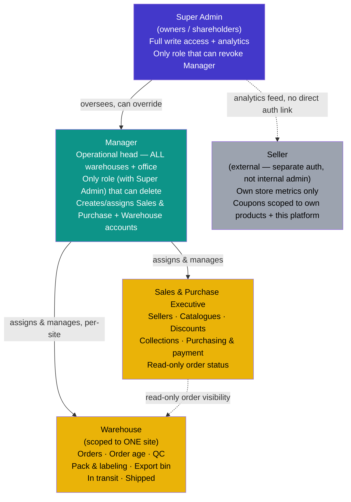

# WishDrop — Roles, Permissions & Policy Map

*Defines every platform role, what each can see/do, and the governing policies. Covers internal admin roles + the external Seller Dashboard. Public storefront and signed-in customer account pages are out of scope here — this is the admin/ops side only.*

**Defaults applied where a decision was still open (flagged inline — confirm or override):**
- Super Admin = full write access across the platform, in addition to analytics/oversight and role & platform management — effectively a superset of every other role.
- Manager = full operational control across all warehouses **and** creates/assigns Sales & Purchase / Warehouse staff accounts.

---

## 1. Role hierarchy

```
Super Admin        — owners/shareholders. Oversight & analytics. Not in daily ops.
   │
Manager            — operational head. Spans ALL warehouses + office. Runs the business day to day.
   │
   ├── Sales & Purchase Executive   — sourcing, catalogue, pricing, purchasing
   └── Warehouse                    — fulfillment pipeline, scoped to ONE warehouse site

(separate, external)
Seller              — third-party affiliated stores. Own auth scope. Never shares admin session.
```

**Key structural rule:** Sales & Purchase Executive and Warehouse are **siblings**, not a hierarchy between themselves — neither can act on the other's domain. Manager is the only role with reach across both, and across every warehouse location. Warehouse-role accounts are scoped to **one site**; Manager is the only operational role with cross-site reach.



*Dotted lines indicate read-only or non-hierarchical relationships (Sales & Purchase's view into order status; Seller data feeding Super Admin analytics without any shared authentication path).*

---

## 2. Full permission matrix

Legend: ✅ full write access · 👁 view/read-only · ❌ no access

| Feature / Action | Super Admin | Manager | Sales & Purchase Exec | Warehouse (own site) |
|---|---|---|---|---|
| **Sourcing & Catalogue** | | | | |
| Add/edit sellers — manual entry | ✅ | ✅ | ✅ | ❌ |
| Add/edit sellers — scraping/extractor config | ✅ | ✅ | ✅ | ❌ |
| Add/edit catalogues | ✅ | ✅ | ✅ | ❌ |
| Discount management | ✅ | ✅ | ✅ | ❌ |
| Collection filtering (auto rules) | ✅ | ✅ | ✅ | ❌ |
| Collection manual curation (hand-picked adds) | ✅ | ✅ | ✅ | ❌ |
| Purchase execution (placing the buy) | ✅ | ✅ | ✅ | ❌ |
| Payment handling for purchases | ✅ | ✅ | ✅ | ❌ |
| **Fulfillment Pipeline** | | | | |
| View orders | ✅ (all sites) | ✅ (all sites) | 👁 | ✅ (own site) |
| Order age / SLA tracking | ✅ (all sites) | ✅ (all sites) | 👁 | ✅ (own site) |
| Quality Check (QC) | ✅ (all sites) | ✅ (all sites) | ❌ | ✅ (own site) |
| Pack & labeling | ✅ (all sites) | ✅ (all sites) | ❌ | ✅ (own site) |
| Export bin management | ✅ (all sites) | ✅ (all sites) | ❌ | ✅ (own site) |
| In-transit status updates | ✅ (all sites) | ✅ (all sites) | ❌ | ✅ (own site) |
| Shipped / delivered status updates | ✅ (all sites) | ✅ (all sites) | ❌ | ✅ (own site) |
| **Destructive Actions** | | | | |
| Delete order | ✅ | ✅ | ❌ | ❌ |
| Delete catalogue/listing | ✅ | ✅ | ❌ | ❌ |
| Delete seller record | ✅ | ✅ | ❌ | ❌ |
| Delete discount/coupon | ✅ | ✅ | ❌ | ❌ |
| **Chat / Support (from prior WhatsApp-sync work)** | | | | |
| View customer chat threads | ✅ | ✅ | ✅ (own leads/orders) | ❌ |
| Reply in customer chat thread | ✅ | ✅ | ✅ | ❌ |
| Trigger automated WhatsApp sync (n8n) | ✅ (system-level) | ✅ (system-level) | — (system-triggered, not manual) | ❌ |
| **Staffing & Platform** | | | | |
| Create/assign Sales & Purchase accounts | ✅ | ✅ | ❌ | ❌ |
| Create/assign Warehouse accounts (per site) | ✅ | ✅ | ❌ | ❌ |
| Assign/revoke Manager role | ✅ only | ❌ | ❌ | ❌ |
| Platform-wide settings (payment gateway, pricing engine config, etc.) | ✅ only | ❌ | ❌ | ❌ |
| Cross-warehouse & cross-channel analytics | ✅ | ✅ | ❌ | ❌ |
| Per-site operational reporting | ✅ | ✅ | ❌ | 👁 (own site) |

---

## 3. Seller Dashboard (external, separate scope)

**Not an admin role.** Sellers are third-party affiliated stores (Channel 1) — they must never share the internal admin auth/session system, and must never see anything outside their own store's data.

| Feature | Access |
|---|---|
| Store-wise order metrics (received / dispatched / pending) | ✅ own store only |
| Coupon creation for own products | ✅ own store only |
| Coupon scope enforcement | Must be locked to: this seller + this platform + this seller's products. A seller cannot create a platform-wide or cross-seller discount. |
| View other sellers' data | ❌ — structurally impossible, not just permission-gated |
| View internal admin tools (orders pipeline, chat, staffing) | ❌ |
| Delete own catalogue entries | ❌ — deactivate/hide only (prevents orphaning open orders); actual delete stays Manager-only, same as internal delete policy |

---

## 4. Governing policies

### 4.1 Delete policy
- **Super Admin and Manager can both delete anything**, across every deletable entity (orders, listings, sellers, discounts). Super Admin's delete access sits above Manager's, not alongside it as a separate carve-out — it's part of Super Admin's full-write-access default.
- Sellers never get hard-delete on their own listings — deactivate/hide only, to avoid orphaning in-flight orders tied to that listing.
- Every delete action should be soft-deleted (flagged, not removed) at the database level regardless of role, so disputes/audits aren't blocked by an irreversible action — this mirrors the same "never hard-delete" principle already applied to the 30-day chat display window.
- Because two roles now hold delete rights, the `audit_log` (§5) matters more, not less — every delete needs an immutable record of *which* role/account performed it.

### 4.2 Scoping policy
- **Warehouse role = single-site scope.** A Warehouse account only sees/acts on orders routed to their own warehouse. This is what structurally distinguishes Warehouse from Manager — same feature set, different reach.
- **Manager = all-site scope.** The only operational role with cross-warehouse reach, by design — this is what makes Manager "the person responsible in the field across all warehouses and the office."
- **Sales & Purchase Executive = functional scope, not site scope** — their domain is sourcing/catalogue/pricing, which isn't warehouse-bound, so no site restriction applies to them.
- **Sellers = own-store scope, enforced structurally** (separate table/auth, not a shared `users` table with a role flag) so a query bug can't leak cross-seller data.

### 4.3 Visibility (read-only) policy
- Super Admin now has full write access in addition to analytics/reporting — no longer positioned as view-only. Worth deciding in practice whether owners *actually use* this write access day to day, or hold it as a capability without exercising it — the permission existing doesn't mean it needs to be part of a Super Admin's routine workflow.
- Sales & Purchase gets **read-only visibility into order status** (not QC/warehouse actions) so they can answer a customer chat question ("your item is in QC") without being able to change warehouse state.
- Warehouse gets **no visibility into sourcing/catalogue/pricing** — no functional need, keeps the pipeline's two halves cleanly separated.

### 4.4 Staffing policy
- Manager creates and assigns both Sales & Purchase and Warehouse accounts — including which warehouse site a Warehouse account is scoped to.
- Only Super Admin can assign or revoke the Manager role itself — this is the one staffing action kept at the ownership level, since it's the role with the broadest operational blast radius.

### 4.5 Chat / WhatsApp sync policy (ties to prior WhatsApp architecture work)
- Only Manager and Sales & Purchase can reply in customer chat threads — Warehouse has no customer-facing role.
- Automated WhatsApp sync (the n8n-driven outbound flow) fires as a system-level trigger off any qualifying reply — it is not a separate manual action any role clicks, so no distinct "WhatsApp send" permission is needed beyond "can reply in chat."

---

## 5. Suggested schema shape

```
roles              (id, name)                         -- super_admin, manager, sales_purchase, warehouse
permissions        (id, key)                            -- e.g. 'order:delete', 'catalogue:write', 'qc:write'
role_permissions   (role_id, permission_id)
warehouses         (id, name, location)
admin_users        (id, name, email, role_id, warehouse_id?)   -- warehouse_id only set for Warehouse role
sellers            (id, name, store_name, ...)          -- fully separate table
seller_sessions    (seller_id, ...)                       -- separate auth, never joins admin_users
audit_log          (id, actor_id, actor_role, action, entity, entity_id, created_at)  -- every delete + role change
```

`warehouse_id` on `admin_users` is what enforces the single-site scope for Warehouse accounts at the data layer, not just the UI layer — a Warehouse-role query should always filter by the account's own `warehouse_id`, never trust a client-supplied site parameter.

An `audit_log` table is recommended given how much of this policy set revolves around delete rights and role assignment — both are exactly the actions worth having an immutable record of, independent of the soft-delete pattern in §4.1.

---

## 7. Page routes

Two separate route trees, matching the structural split in §1: **`/admin`** is the shared operational surface for Manager, Sales & Purchase Executive, and Warehouse; **`/super-admin`** is the owner-only oversight surface. Both sit alongside the existing public site and signed-in customer `/account` routes, which are out of scope here.

`/admin` uses three **Next.js route groups** — `(sales)`, `(warehouse)`, `(manager)` — so role-specific pages get their own `layout.tsx` auth guard without changing the URL (the parenthesized folder name never appears in the path). Pages used by more than one role (orders, requests, chat, dashboard, settings) sit outside any group, with scoping enforced in the page/component itself.

### 7.1 `/admin` — shared shell (no route group; multi-role or role-agnostic)

| Route | Folder | Who reaches it | What the user can do here |
|---|---|---|---|
| `/admin/login` | `admin/login` | Manager, Sales & Purchase, Warehouse | Sign in with admin credentials; no other action. |
| `/admin/dashboard` | `admin/dashboard` | All three roles (content varies) | View a rollup of what matters to their role: Manager sees all-site order/QC/shipping counts; Warehouse sees only their own site's queue; Sales & Purchase sees open purchases + pending catalogue/discount tasks. No cross-role editing from this page — it's a summary/launchpad only. |
| `/admin/orders` | `admin/orders` | Manager (write, all sites), Warehouse (write, own site), Sales & Purchase (view only) | Manager/Warehouse: update order status along the pipeline, reassign an order to a different warehouse (Manager only), flag an order as delayed. Sales & Purchase: view status and order age only — cannot change anything here. |
| `/admin/orders/[orderId]` | `admin/orders/[orderId]` | Same as above | Same actions as the list view, scoped to one order — view full order detail (items, customer, channel), and (Manager/Warehouse only) advance/roll back its pipeline stage, add an internal note. |
| `/admin/orders/age` | `admin/orders/age` | Manager, Warehouse (own site), Sales & Purchase (view) | View orders sorted/filtered by how long they've sat in their current stage, to spot SLA breaches. Manager can bulk-flag aged orders for review; others view only. |
| `/admin/requests` | `admin/requests` | Manager, Sales & Purchase | View incoming Channel 3 (unscrapeable-link) requests; Sales & Purchase can open a request to begin manual pricing/quoting; Manager can additionally reassign or close a request. |
| `/admin/requests/[requestId]` | `admin/requests/[requestId]` | Manager, Sales & Purchase | View the request's link/note/screenshot, set or edit a manual quote, mark the request quoted/confirmed/rejected, jump into the linked chat thread. |
| `/admin/chat` | `admin/chat` | Manager, Sales & Purchase (Warehouse excluded — no customer-facing role) | View the list of customer chat threads (one per customer, per §2a), see unread counts, search/filter by customer. |
| `/admin/chat/[customerId]` | `admin/chat/[customerId]` | Manager, Sales & Purchase | Read the customer's full thread (30-day display window), send a reply (auto-synced to WhatsApp per the n8n architecture in §5), attach an image/video, tag a reply to a specific `requestId` for context. |
| `/admin/settings/profile` | `admin/settings/profile` | All three roles | Edit their own name, password, notification preferences. Cannot edit anyone else's account from here. |
| `/admin/settings/notifications` | `admin/settings/notifications` | All three roles | Toggle which events they get notified about (new request, order delayed, chat message, etc.) — personal preference only, not a platform-wide setting. |

### 7.2 `(sales)` route group — Sales & Purchase Executive

| Route (URL) | Folder | What the user can do here |
|---|---|---|
| `/admin/sellers` | `admin/(sales)/sellers` | View the list of affiliated sellers; search/filter by status. |
| `/admin/sellers/new` | `admin/(sales)/sellers/new` | Add a new seller manually (name, store details, contact) — the "adding sellers" action from the original role brief. |
| `/admin/sellers/[sellerId]` | `admin/(sales)/sellers/[sellerId]` | Edit a seller's profile/details; deactivate a seller (hard delete stays Manager/Super-Admin-only per §4.1). |
| `/admin/sellers/[sellerId]/scrape-config` | `admin/(sales)/sellers/[sellerId]/scrape-config` | Configure or edit the scraping/extractor settings for this seller's store (the "scraping configuration" half of the original brief) — set which fields to extract, test the extractor against a sample URL. |
| `/admin/catalogues` | `admin/(sales)/catalogues` | View all catalogue entries across sellers; filter/search. |
| `/admin/catalogues/new` | `admin/(sales)/catalogues/new` | Add a new catalogue entry — either manually or by pulling from a seller's feed. |
| `/admin/catalogues/[catalogueId]` | `admin/(sales)/catalogues/[catalogueId]` | Edit a catalogue entry's details, pricing inputs, images, variants; remove it from active listing (deactivate, not hard delete). |
| `/admin/discounts` | `admin/(sales)/discounts` | View all active/past discounts. |
| `/admin/discounts/new` | `admin/(sales)/discounts/new` | Create a new discount — set percentage/amount, eligible products or collections, validity window. |
| `/admin/discounts/[discountId]` | `admin/(sales)/discounts/[discountId]` | Edit or pause a discount; view its usage so far. |
| `/admin/collections` | `admin/(sales)/collections` | View all storefront collections. |
| `/admin/collections/[collectionId]` | `admin/(sales)/collections/[collectionId]` | Edit a collection's name, description, and auto-filter rules. |
| `/admin/collections/[collectionId]/curate` | `admin/(sales)/collections/[collectionId]/curate` | Manually add or remove specific products into/out of the collection, independent of the auto-filter rules — the "manual adding" action from the original brief. |
| `/admin/purchases` | `admin/(sales)/purchases` | View all purchases made on customers' behalf, filterable by status (pending, purchased, failed). |
| `/admin/purchases/[purchaseId]` | `admin/(sales)/purchases/[purchaseId]` | Execute a purchase (mark as bought, attach a receipt/reference), update purchase status. |
| `/admin/purchases/[purchaseId]/payment` | `admin/(sales)/purchases/[purchaseId]/payment` | Record or confirm the payment made to the source store for this purchase — the "handling the payment" action from the original brief. |

### 7.3 `(warehouse)` route group — Warehouse (per-site scoping enforced in code, not by folder)

| Route (URL) | Folder | What the user can do here |
|---|---|---|
| `/admin/qc` | `admin/(warehouse)/qc` | View the Quality Check queue for their own warehouse site only. |
| `/admin/qc/[orderId]` | `admin/(warehouse)/qc/[orderId]` | Log QC results for one order — pass/fail, attach inspection photos/notes, flag a defect for ops/customer follow-up. |
| `/admin/pack-labeling` | `admin/(warehouse)/pack-labeling` | View the pack & labeling queue for their site. |
| `/admin/pack-labeling/[orderId]` | `admin/(warehouse)/pack-labeling/[orderId]` | Mark an order as packed, print/generate a shipping label, confirm package weight/dimensions. |
| `/admin/export-bin` | `admin/(warehouse)/export-bin` | View and manage which packed orders are staged for the next export/shipment batch; add or remove an order from the current bin. |
| `/admin/in-transit` | `admin/(warehouse)/in-transit` | View orders currently in transit; update tracking info if it changes. |
| `/admin/shipped` | `admin/(warehouse)/shipped` | View/confirm final shipped status; mark an order delivered once confirmation comes back. |

### 7.4 `(manager)` route group — Manager-exclusive within `/admin`

| Route (URL) | Folder | What the user can do here |
|---|---|---|
| `/admin/staff` | `admin/(manager)/staff` | View all Sales & Purchase and Warehouse staff accounts across every site. |
| `/admin/staff/new` | `admin/(manager)/staff/new` | Create a new Sales & Purchase or Warehouse account; if Warehouse, assign it to a specific site. |
| `/admin/staff/[staffId]` | `admin/(manager)/staff/[staffId]` | Edit a staff account's details, reassign a Warehouse account to a different site, deactivate an account (hard delete restricted per §4.1). |
| `/admin/staff/warehouses` | `admin/(manager)/staff/warehouses` | View the list of registered warehouse sites, used when assigning a Warehouse account to one. |
| `/admin/reports` | `admin/(manager)/reports` | View operational reporting rolled up across every warehouse site (order age, QC pass rate, shipping SLA hits/misses). |
| `/admin/reports/[siteId]` | `admin/(manager)/reports/[siteId]` | Drill into one warehouse site's own operational report. |

### 7.5 `/super-admin` — ownership/oversight surface

| Route | Who reaches it | What the user can do here |
|---|---|---|
| `/super-admin/login` | Super Admin | Sign in with owner-level credentials. |
| `/super-admin/analytics` | Super Admin | View the top-level analytics overview — revenue, order volume, channel mix at a glance. |
| `/super-admin/analytics/revenue` | Super Admin | View revenue broken down by period, channel, or seller — read-only, no editing. |
| `/super-admin/analytics/orders` | Super Admin | View order volume, Channel 1/2/3 split, conversion rates. |
| `/super-admin/analytics/sellers` | Super Admin | View per-seller performance — orders received/dispatched/pending, feeding the same metrics sellers see for their own store (§3), aggregated across all sellers here. |
| `/super-admin/analytics/ops` | Super Admin | View order age, QC turnaround, and shipping SLA hits/misses across every warehouse site. |
| `/super-admin/analytics/whatsapp-cost` | Super Admin | View per-domain and per-conversation WhatsApp cost tracking (ties to the extractor-as-cost-lever strategy from the WhatsApp summary doc). |
| `/super-admin/roles` | Super Admin | View all defined roles and their permission sets. |
| `/super-admin/roles/[roleId]` | Super Admin | Edit what a role can do — add/remove permissions from Manager, Sales & Purchase, or Warehouse. |
| `/super-admin/staff` | Super Admin | View every staff account platform-wide, including Managers. |
| `/super-admin/staff/new` | Super Admin | Create a new account of **any** role, including Manager — this is the only place a Manager account can be created (§4.4). |
| `/super-admin/staff/[staffId]` | Super Admin | Edit or deactivate any staff account, including reassigning or revoking the Manager role. |
| `/super-admin/settings/payment-gateway` | Super Admin | Configure the Indian payment gateway integration once it's wired in (per the open item in the original requirements doc). |
| `/super-admin/settings/pricing-engine` | Super Admin | Adjust the parameters `lib/pricing.ts`/`lib/quote.ts` run on (margins, fee structure) — platform-wide, affects every displayed price. |
| `/super-admin/settings/templates` | Super Admin | Create/edit/submit WhatsApp message templates for Meta approval (§6 of the WhatsApp summary doc). |
| `/super-admin/settings/integrations` | Super Admin | Manage n8n workflow connections and Meta app credentials (access token, phone number ID, webhook verify token). |
| `/super-admin/audit-log` | Super Admin | View the immutable log of every delete and role-assignment action platform-wide (§5). |
| `/super-admin/audit-log/[entryId]` | Super Admin | View full detail of a single audit entry — who, what, when, before/after state. |
| `/super-admin/settings/profile` | Super Admin | Edit their own account details. |

**Routing note on the overlap:** since Super Admin now holds a superset of Manager's permissions, the recommended default is that Super Admin logs into `/admin` directly for operational work (orders, sellers, QC, etc. — same pages Manager uses), rather than duplicating that entire surface under `/super-admin/*`. `/super-admin` is reserved for what's genuinely exclusive to that tier: analytics, role editing, platform settings, and the audit log, as tabled above.

### 7.6 Out of scope here (flagged for a separate routing pass)

- **Seller Dashboard** — needs its own route tree entirely (e.g. `/seller/dashboard`, `/seller/orders`, `/seller/coupons`), on a fully separate auth system per §2/§4.2's structural-separation requirement. Not included above since it's not part of `/admin` or `/super-admin`.
- Public storefront and signed-in customer `/account` routes — already exist per the original WishDrop requirements doc, unaffected by this role work.

---

## 8. Open items still worth a decision

- [x] ~~Super Admin write access~~ — resolved: full write access, superset of every other role.
- [ ] Since Super Admin and Manager now hold near-identical operational reach, decide if there's any distinction left between them beyond "who can revoke Manager" and "who can touch platform settings" — or whether Super Admin is meant to *rarely* exercise its operational write access in practice, reserving it for oversight + emergency intervention rather than routine use.
- [ ] Decide whether Sales & Purchase's read-only order visibility should extend to QC/shipping stages too (currently scoped to order status only, not pipeline-stage detail) — relevant for how much they can tell a customer in chat without pinging Warehouse.
- [ ] Decide whether Manager needs any restriction at all, given they now have near-total operational reach — e.g. should large payment actions (purchasing) require a second approval, or is single-Manager authority acceptable at current scale?
- [ ] Decide seller onboarding: does Manager approve new sellers, or does Sales & Purchase Executive have full unilateral authority to add one (currently modeled as ✅ for both)?
- [ ] Confirm the routing approach in §7.5 — recommended default is Super Admin uses `/admin/*` directly for operational work (rather than a duplicated `/super-admin/*` mirror), reserving `/super-admin` for analytics, roles, platform settings, and the audit log only.